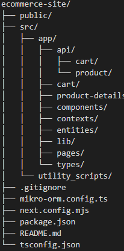

# E-Commerce Website Clone

This project is a replica of a sample e-commerce website, featuring a home page with a product grid and individual product pages. It's built using Next.js, Next UI, and Tailwind CSS for the frontend, with MikroORM handling the backend database operations.

## Features

- Home Page with a responsive product grid layout
- Clicking on the main product image switches to a page with more details about the product
- Clicking on the "not-amazon" logo returns to the homepages
- Clicking add-to-cart adds a new row to the mysql database

### Frontend
- Next.js 14.2.7 (for server-side rendering & routing)
- Next UI 2.4.6 (for building UI components)
- Tailwind CSS 3.4.10 (for styling components)
- React 18.3.1
### Backend
- Next.js API Routes
- MikroORM with MySQL adapter

### Prerequisites
- Node.js (version 14 or later recommended)
- npm (comes with Node.js)
- MySQL (version 5.7 or later)

### Getting Started

1. Clone the repository: 
git clone https://github.com/benwen321/ecommerce_site
2. Enter into the directory: cd ecommerce_site
3. Install project dependences using: npm install
4. Install MYSQL and create a new database. Note down your username, the database name, and password. 
5. Modify mikro-orm.config.ts to include your login and database name.
6. Create the database schema using: npm run create-schema
7. Seed the database with the initial data using: npm run seed
9. After running the seed command, the console should log the ID of the newly inserted product (ie. ID = 1). In"ecommerce-site\src\app\page.tsx and ecommerce-site\src\app\product-details\page.tsx, modify lines 24 and 17 respectively, with the ID of the newly inserted product
8. Start the development server using: npm run dev
9. The application will begin at http://localhost:3000

### Project Structure

This structure follows the app-router structure of next.js. Since all api-handling was done locally, the utility scripts are used for setting up the database schema and seeding the database. The front-end is centered around ecommerce-site\src\app\page.tsx, which is the homepage that initially loads. The components folder holds key objects that the pages use: the header component, which is displayed via the layout.tsx file, is present in all pages. The ProductCard component is used to display the product-information cards. 

### Future Improvements
1. The current code has not implement buttons for selecting the quantity of a product to add to cart. Right now, the add-to-cart buttons only add one count of the product to the cart. 
2. The current cart icon is static. An improvement would be to update the cart icon to reflect the number of items in the cart. 
3. This project displays images that are saved locally. Whilst it works for URLs too, not all images will look good due to the dimensions. A future optimization could be dynamically shifting and resizing components to better fit all types of images. 
4. The cart is not fully built yet. Code in CartContext.tsx is a work-in-progress! (so are the increment and decrement buttons in product card)
